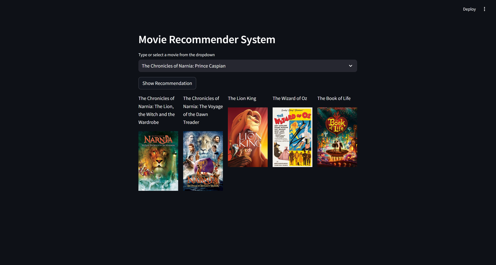

# Movie Recommender System 🎥

This is a **Movie Recommender System** application built using Streamlit. The app suggests movies based on the user's selected movie and displays the movie posters for a visually engaging experience.

## Features

- **Movie Recommendations:** Suggests 5 movies similar to the selected movie.
- **Poster Display:** Fetches and displays posters for recommended movies using TMDb API.
- **Interactive UI:** Simple and user-friendly interface built with Streamlit.

## Usage

1. Run the Streamlit app:
    ```bash
    streamlit run app.py
    ```

2. Open the app in your browser at the provided link (usually `http://localhost:8501`).

3. Select a movie from the dropdown menu and click **Show Recommendation** to see similar movies along with their posters.

## Code Overview

### Key Components:

1. **TMDb API Integration:**
    - Fetches movie posters using the TMDb API.

2. **Recommendation Logic:**
    - Computes similarity between movies using a precomputed similarity matrix.
    - Recommends the top 5 most similar movies.

3. **Streamlit Interface:**
    - Dropdown for movie selection.
    - Button to display recommendations.
    - Columns to arrange movie posters and titles neatly.

### Screenshot



### Example Code

#### Input Example:
- Selected Movie: `The Chronicles of Narnia:Prince Caspian`

#### Output:
```plaintext
Recommended Movies:
1. The Chronicles of Narnia:The Lion,the Witch and the Wardrobbe
2. The Chronicles of Narnia:The Voyage of the Dawn Treader
3. The Lion King
4. The Wizard of Oz
5. The Book of Life


